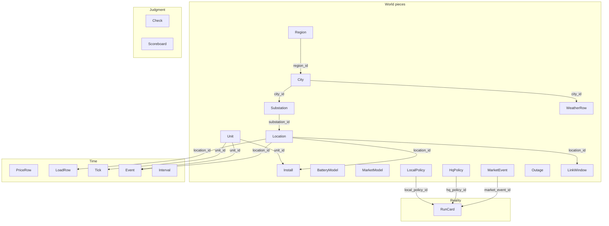
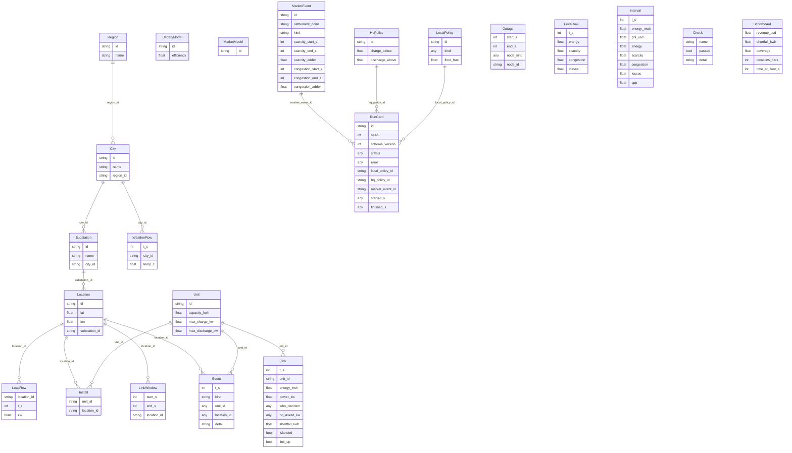

# Data model

Generated from `battery_fleet.types`. Do not edit by hand. Regenerate: `python -m battery_fleet diagram`.

## Four planes

```mermaid
flowchart TB
  subgraph p1["World pieces"]
    Region
    City
    Substation
    Location
    Unit
    Install
    BatteryModel
    MarketModel
    LocalPolicy
    HqPolicy
    MarketEvent
    WeatherRow
    Outage
    LinkWindow
  end
  subgraph p2["Reality"]
    RunCard
  end
  subgraph p3["Time"]
    PriceRow
    LoadRow
    Tick
    Event
    Interval
  end
  subgraph p4["Judgment"]
    Check
    Scoreboard
  end
  Region -->|region_id| City
  City -->|city_id| Substation
  Substation -->|substation_id| Location
  Unit -->|unit_id| Install
  Location -->|location_id| Install
  City -->|city_id| WeatherRow
  Location -->|location_id| LoadRow
  Location -->|location_id| LinkWindow
  Unit -->|unit_id| Tick
  Unit -->|unit_id| Event
  Location -->|location_id| Event
  LocalPolicy -->|local_policy_id| RunCard
  HqPolicy -->|hq_policy_id| RunCard
  MarketEvent -->|market_event_id| RunCard
```

## Entities and fields

```mermaid
erDiagram
  Region {
    string id
    string name
  }
  City {
    string id
    string name
    string region_id
  }
  Substation {
    string id
    string name
    string city_id
  }
  Location {
    string id
    float lat
    float lon
    string substation_id
  }
  Unit {
    string id
    float capacity_kwh
    float max_charge_kw
    float max_discharge_kw
  }
  Install {
    string unit_id
    string location_id
  }
  BatteryModel {
    string id
    float efficiency
  }
  MarketModel {
    string id
  }
  LocalPolicy {
    string id
    any kind
    float floor_frac
  }
  HqPolicy {
    string id
    float charge_below
    float discharge_above
  }
  MarketEvent {
    string id
    string settlement_point
    string kind
    int scarcity_start_s
    int scarcity_end_s
    float scarcity_adder
    int congestion_start_s
    int congestion_end_s
    float congestion_adder
  }
  WeatherRow {
    int t_s
    string city_id
    float temp_c
  }
  LoadRow {
    string location_id
    int t_s
    float kw
  }
  Outage {
    int start_s
    int end_s
    any node_kind
    string node_id
  }
  LinkWindow {
    int start_s
    int end_s
    string location_id
  }
  PriceRow {
    int t_s
    float energy
    float scarcity
    float congestion
    float losses
  }
  Tick {
    int t_s
    string unit_id
    float energy_kwh
    float power_kw
    any who_decided
    any hq_asked_kw
    float shortfall_kwh
    bool islanded
    bool link_up
  }
  Event {
    int t_s
    string kind
    any unit_id
    any location_id
    string detail
  }
  Interval {
    int t_s
    float energy_mwh
    float pnl_usd
    float energy
    float scarcity
    float congestion
    float losses
    float spp
  }
  Check {
    string name
    bool passed
    string detail
  }
  Scoreboard {
    float revenue_usd
    float shortfall_kwh
    float coverage
    int locations_dark
    int time_at_floor_s
  }
  RunCard {
    string id
    int seed
    int schema_version
    any status
    any error
    string local_policy_id
    string hq_policy_id
    string market_event_id
    any started_s
    any finished_s
  }
  Region ||--o{ City : region_id
  City ||--o{ Substation : city_id
  Substation ||--o{ Location : substation_id
  Unit ||--o{ Install : unit_id
  Location ||--o{ Install : location_id
  City ||--o{ WeatherRow : city_id
  Location ||--o{ LoadRow : location_id
  Location ||--o{ LinkWindow : location_id
  Unit ||--o{ Tick : unit_id
  Unit ||--o{ Event : unit_id
  Location ||--o{ Event : location_id
  LocalPolicy ||--o{ RunCard : local_policy_id
  HqPolicy ||--o{ RunCard : hq_policy_id
  MarketEvent ||--o{ RunCard : market_event_id
```
