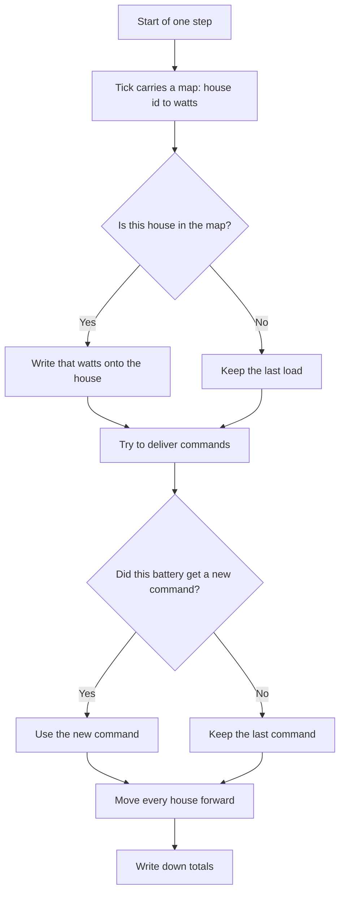
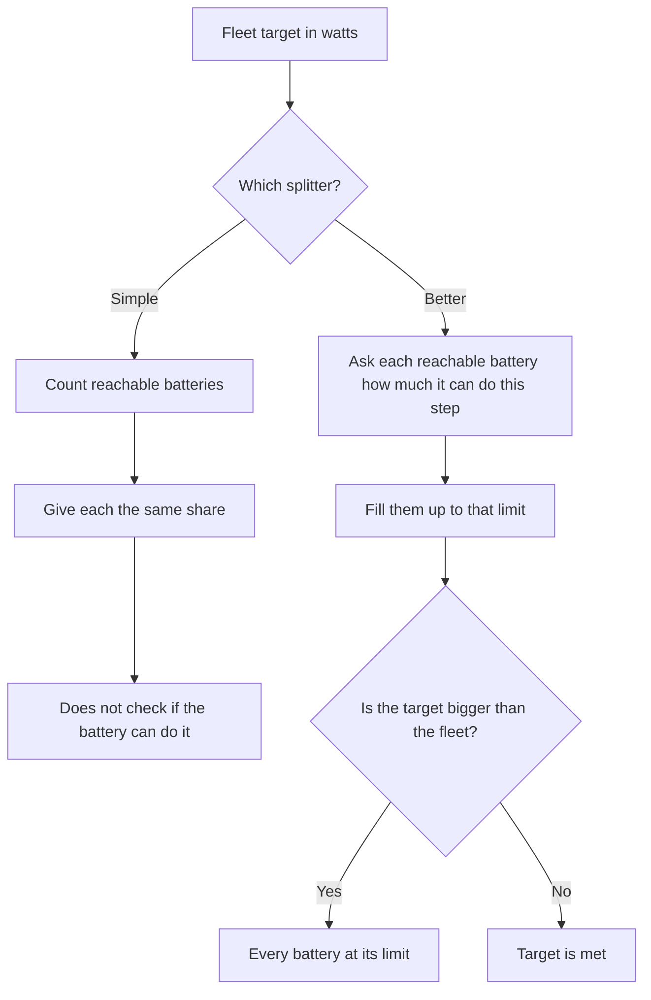
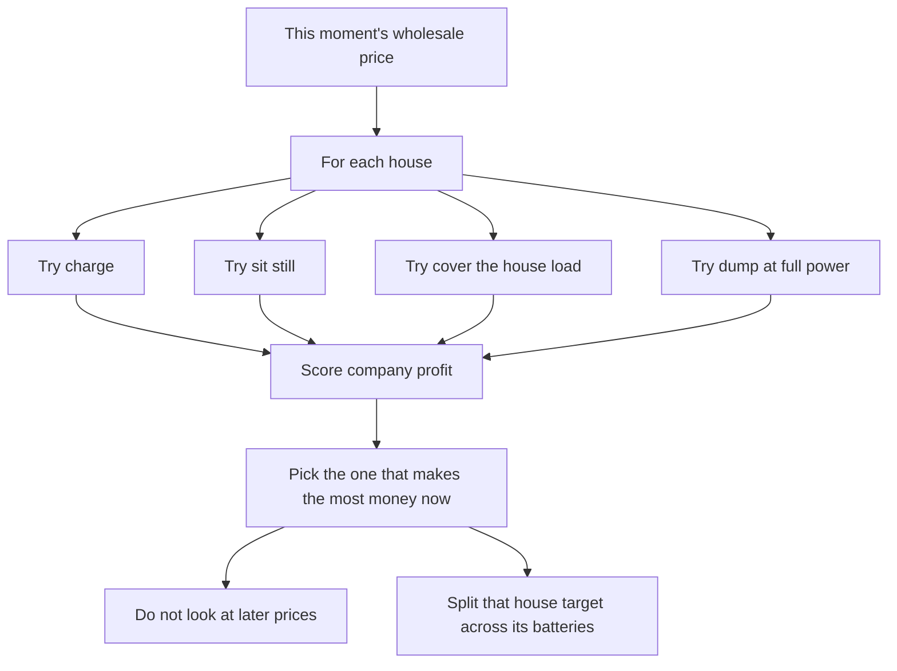
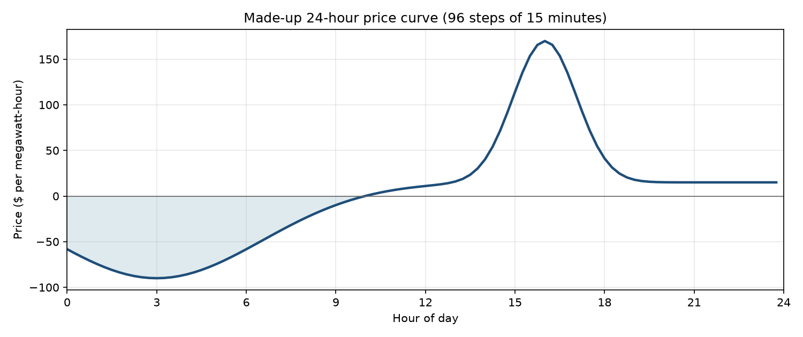

# What exists

Each battery keeps a charge level, a size, power limits, and a yes-or-no “can we reach it” flag. See [`UnitState`](../battery_fleet/battery.py#L35-L49).

If the battery is offline, a new command does not arrive. The last command keeps running. See [`go_offline` / `command_power_watts`](../battery_fleet/battery.py#L139-L156).

When time moves forward, the battery turns the command into what it can actually do, then updates charge. Charging and discharging waste a little energy. It will not discharge below a reserve. Charge cannot go past empty or full. See [`step`](../battery_fleet/battery.py#L158-L178) and [`_update_state_of_charge`](../battery_fleet/battery.py#L271-L316).

A house is a place on the map with one or more batteries. Power from the grid is house use plus battery power. Positive means the house is pulling from the grid. Negative means it is sending power out. See [`_update_grid_power`](../battery_fleet/installation.py#L93-L117).

A fleet is many houses. The usual build is 80 houses and 100 batteries. Every battery is the same: 10 kWh and 10 kW. Twenty houses get a second battery. They sit in Austin neighborhoods. See [`build_fleet`](../battery_fleet/fleet.py#L48-L94).

## The clock

The clock works like this. Each step sets house load, tries to deliver commands, moves every house forward, then writes down totals. If a battery gets no new command, it keeps the last one. See [`run_fleet`](../battery_fleet/loop.py#L115-L175).

House load is not computed. Each step is handed a map of house id to watts. See [`FleetTickInput`](../battery_fleet/loop.py#L31-L37). The clock walks that map and writes the number onto the house. See [`set_user_load_power_watts`](../battery_fleet/installation.py#L60-L69). A house left out of the map keeps whatever load it had last time. Load cannot be negative. In the demo day every house is 1500 W on every step. There is no real household load curve yet. See [`LOAD_WATTS`](../battery_fleet/demo.py#L6-L30).



## What each step writes down

The summary includes:

- how much the fleet was asked to do
- how much it did
- the gap between those two
- how many batteries we could not reach
- a money score, if a price was given: company profit, customer bill, and the no-battery customer bill

See [`FleetTickRecord`](../battery_fleet/loop.py#L191-L250).

## How a fleet target is split

There are two ways to split a fleet target across batteries. The simple way gives every reachable battery the same share and does not check whether that battery can actually do it. See [`split_target`](../battery_fleet/control.py#L6-L23).

The better way fills batteries up to what they can do this step. If the target is bigger than the whole fleet, every battery is pushed to its limit. See [`allocate_target`](../battery_fleet/control.py#L26-L78).



## How we pick charge or discharge

The first price-based choice is called greedy. It looks at this moment only and scores company profit. For each house it tries charge, sit still, cover the house load, or dump at full power. It picks the choice that makes the most company profit right now. It does not look at later prices. Two batteries at one house share one target. See [`greedy`](../battery_fleet/control.py#L100-L145).



## Two bills

This is the money model. See [`score_tick`](../battery_fleet/economics.py). Each house has its own meter. Bills are scored per house, then added.

The company is the customer’s power provider. The customer pays the company. The company then settles the net meter on the wholesale market. Those are two different bills. We keep both, because a large part of user value is a lower bill, and we can only push company revenue up to the point where users are still happy with the service.

The **company book** is the wholesale settlement on the meter. If the meter is importing, the company pays the wholesale price. If the meter is exporting, the company earns the wholesale price. Wear and the miss penalty stay on this book. Wires charges from the local utility can wait.

The **customer bill** is what the home pays the company. They pay 14 cents per kilowatt-hour on the house energy that still came from the grid. Charging is not passed through to that bill. Export does not credit that bill. If the battery covers the house, the customer bill drops. See [`customer_billable_watts`](../battery_fleet/economics.py).

Company profit is what the customer paid, plus wholesale dollars on the meter, minus wear.

```
company profit = customer payments + wholesale on the meter − wear
customer bill  = 14¢ × max(0, min(meter, house load)) in kilowatt-hours
```

The controller maximizes company profit. It may not make the customer bill worse than the same day with no battery. It still may not discharge below the reserve. That is the “users are still happy” cap. Backup charge and a bill that did not go up are the service promise. Wholesale revenue is what we take after that.

Under this tariff the bill cap does not bind. Charging is not passed through, so it does not raise the customer bill. Discharging can only lower it. Do not build a bill-cap constraint until a later tariff can actually break it. Reserve still binds.

Wholesale money can be added across houses. Customer bills cannot. A house that saves cannot pay for a house that got worse. See [`test_customer_bills_do_not_net_across_houses`](../tests/test_dispatch.py#L121-L138).

A later wires charge from the local utility can sit on the company book. It does not change this split.

The live score also writes a flat five-dollar add-on and a miss penalty. The add-on is included only when the fleet actually moved. It does not change whether we charge or discharge. Wear is 5 cents per kilowatt-hour moved. The miss penalty is 20 cents per kilowatt-hour of commanded minus actual. See [`score_tick`](../battery_fleet/economics.py#L53-L112).

```
company profit = customer payments + wholesale on the meter + $5 add-on − wear − miss penalty
```

Not every discharged kilowatt-hour is worth the same. The first 1.5 kilowatts at a house cover the load, and the company loses the 14 cents it would have collected. Everything past that is export, and the company does not lose that 14 cents. Cover is worth the wholesale price minus wear minus 14 cents. Export is worth the wholesale price minus wear. Charging is only worth doing if the wholesale price is below about −50 dollars per megawatt-hour.

## Prices

`Market` now holds the wholesale prices and the length of each step. A day loop asks it for one price at a time. The fixed 14 cent home rate does not live there. A later real market file can create the same object without changing the controllers. See [`Market`](../battery_fleet/prices.py#L8-L38).

The current prices are still a made-up 24-hour curve: cheap at night, a spike in the afternoon, then a settle. There are 96 steps of 15 minutes. This is not a real market file. See [`market_day_prices`](../battery_fleet/prices.py#L41-L55).



## Look-ahead

The second controller knows all 96 prices before the day starts. It locks one plan for the whole day. It does not re-plan after each step. See [`plan_house`](../battery_fleet/lookahead.py#L15-L87).

The planner works per house type. One-battery houses share one plan. Two-battery houses share another plan. Houses with a different load get a different plan. See [`plan_fleet`](../battery_fleet/lookahead.py#L90-L120).

The locked plan stores a target for each house, not commands for individual batteries. At each step, the target is split across the batteries that are reachable and able to act at that moment. An outage can therefore make actual power miss the locked target. See [`commands_for_targets`](../battery_fleet/lookahead.py#L123-L145) and [`run_lookahead_day`](../battery_fleet/demo.py).

The planner checks the full day and waits for the cheapest hours and the highest-value discharge hours. It keeps charge between full and the reserve. It values covering the house separately from exporting past the house load. On the made-up day, it earns more than greedy. The implementation uses a small set of possible charge levels rather than a new solver library.

## Demo day

The dashboard demo currently runs greedy on that curve. At each step it picks commands from the current price, then steps the fleet. Five batteries go offline during the spike and come back after. See [`run_market_day`](../battery_fleet/demo.py#L10-L68) and [`scripts/demo_market_day.py`](../scripts/demo_market_day.py#L9-L24).

That run is saved as a JSON file. A small local server can read it. A local web page shows a map, charts, and a command list you can scrub through. See [`write_run`](../battery_fleet/store.py#L10-L24), [`serve`](../battery_fleet/serve.py#L23-L37), and the dashboard [`App`](../dashboard/src/App.tsx#L16-L40).

Matched greedy and locked look-ahead generation now exists. It builds two independent fleets from the same seed, runs the same market and outage schedule, and writes both under one comparison id. See [`generate_comparison`](../battery_fleet/comparison.py) and [`scripts/compare_controllers.py`](../scripts/compare_controllers.py).

Normalized comparison runs now separate fleet, installation, and unit grains. Fleet-level ticks and static data stay in `run.json`; installation ticks are in `installation_ticks.jsonl`; unit ticks are in `unit_ticks.jsonl`.

A comparison is discoverable only after its completion manifest is published under `runs/comparisons/`. The manifest is written after both run directories succeed. Failed pair publication removes runs created by that attempt. `list_completed_comparisons()` verifies both referenced runs and ignores orphan or incomplete data.

## Analysis notebook

The executed [controller analysis notebook](../analysis/controller_analysis.ipynb) compares greedy with locked look-ahead using one matched simulation pair. It reads the saved files without running another simulation. Before calculating anything, it checks that both controllers received the same fleet, prices, loads, times, and outage schedule.

The notebook analyzes company profit, customer bills, wholesale settlement, battery wear, missed delivery, unit-level profit contribution, battery charge levels, installation demand, battery power, grid power, and the relationship between wholesale price and grid demand.

It contains seven figures:

1. The first figure compares the distributions of daily unit profit for greedy and look-ahead.
2. The second figure compares daily customer bills across all 80 installations and marks the no-battery bill.
3. The third figure draws all 100 unit charge levels as faint lines. It draws the fleet mean as a solid line and shades one standard deviation around the mean.
4. The fourth figure shows demand, battery power, and grid power for all 80 installations under greedy.
5. The fifth figure shows the same 80 installation charts under look-ahead.
6. The sixth figure aligns wholesale price with total house demand and grid demand from both controllers over time.
7. The seventh figure plots wholesale price against total grid demand for both controllers.

The notebook ends with a controller summary covering company profit, customer bills and savings, wholesale settlement, wear, missed delivery, and the mean, spread, minimum, and maximum unit profit contribution. It selects the newest completed comparison by default or accepts an explicit comparison ID.

How to run all of this is in [the runbook](runbook.md). The plan itself is in [the project plan](project_plan.md). What we decided on August 29 is in [the project log](project-log/2026-08-29.md).

## Next steps

The wholesale price door, the greedy name, and the locked look-ahead are now built.

1. **Add a rolling look-ahead.** Every step, look a few hours ahead, take only the first action, then repeat. The first version can use the real future values from the made-up curve as its forecast. A worse forecast comes later.

2. **Put greedy and locked look-ahead on the dashboard.** Run both on the same day. Show company profit, customer bill, and two power lines.

3. **Add one real day.** Load one real price file through `Market`. Do not build a full history pull until the controller comparison works.
